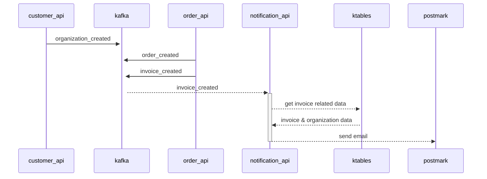
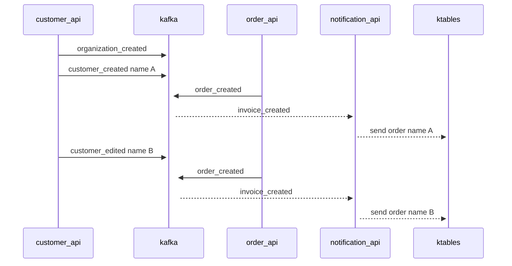

# Kafka & rails

## PoC

PoC that use `Kafka` with [Confluent](https://www.confluent.io)

- customers_api: Handle customers and organizations
- security_api: Handle user access
- orders_api: Handle orders and invoices
- notifications_api: Send emails

Confluent have a way to maintain updated data that comes from different sources. `ktables` (let's think that as a cache service)
With this the order api doesn't need to know the organization name, or the customer email. Just sharing ID's is good enough.




### Produce events

The `rails_kafka_integration` is a gem that handle work as a `producer`

As producer, can be called in 2 ways. Directly with `KafkaRailsIntegration::Producer.produce` or with the model callbacks using the concern `KafkaRailsIntegration::Concerns::Model::Eventeable` that will send after commits the events.
The gem will handle all the events during the callback, and the `KafkaRailsIntegration::Middlewares::DeliverMessages` will send all together right before the callback ends.

`orders_api`, `customers_api` and `security_api` use it.

### Consume events

`notifications_api` consumes the events with `karafka` gem. In order to do it, need to be executed `be rake kafka_consumers:start` this process will be waiting for a new event and process it.
There are many ways to configure `karafka` so you need to check the documentation.

## Run

```sh
# $0>
git clone git@github.com:ruby-kafka-poc/customers_api.git
git clone git@github.com:ruby-kafka-poc/orders_api.git
git clone git@github.com:ruby-kafka-poc/security_api.git
git clone git@github.com:ruby-kafka-poc/notifications_api.git

echo "
---
  version: '3.5'
  
  networks:
    net:
      name: internal_net

  services:

    db:
      image: postgres:14.2-alpine
      restart: always
      networks:
        - net
      environment:
        - POSTGRES_USER=postgres
        - POSTGRES_PASSWORD=postgres
      ports:
        - 5432:5432
      volumes:
        - db:/var/lib/postgresql/data
  
  volumes:
    db:
      driver: local
" >> docker-compose.yml

docker-compose up -d

open https://confluent.cloud
# Create a free account (no credit card needed free for 1 month), create a cluster,
# create a global API key
# go to cluster, cluster overview, cluster settings and get the bootstrap server

# WARNING DO NOT COMMIT THIS THINGS ANYWHERE!!!
echo "
BOOTSTRAP_SERVERS=AAAAAAAAAA:9092
SECURITY_PROTOCOL=sasl_ssl
SASL_MECHANISM=PLAIN
SASL_USERNAME=BBBBBB
SASL_PASSWORD=CCCCCCC
" >> .private_env

# open 4 terminals

# $1>
cd customers_api
cp ../.private_env .
export $(cat ./.private_env | sed 's/#.*//g' | xargs )
bundle install
bundle update
bundle exec rake db:create db:migrate db:seed
bundle exec rails s -p 3001 -b '0.0.0.0'

# $2>
cd orders_api
cp ../.private_env .
export $(cat ./.private_env | sed 's/#.*//g' | xargs )
bundle install
bundle update
bundle exec rake db:create db:migrate db:seed
bundle exec rails s -p 3002 -b '0.0.0.0'

# $3>
cd notifications_api
cp ../.private_env .
export $(cat ./.private_env | sed 's/#.*//g' | xargs )
bundle install
bundle update
bundle exec rake db:create db:migrate db:seed
bundle exec rails s -p 3003 -b '0.0.0.0'

# $4>
cd security_api
cp ../.private_env .
export $(cat ./.private_env | sed 's/#.*//g' | xargs )
bundle install
bundle update
bundle exec rake db:create db:migrate db:seed
bundle exec rails s -p 3004 -b '0.0.0.0'

# lastly we need another terminal to observe kafka, and receive events
cd notifications_api
cp ../.private_env .
export $(cat ./.private_env | sed 's/#.*//g' | xargs )
bundle exec karafka server
```

IMAGE

## Generate some content

```sh
curl --location -g --request POST 'http://localhost:3001/organizations' \
--header 'Content-Type: application/json' \
--data-raw '{ "organization": {"name": "SuperCompany" }}'

curl --location -g --request POST 'http://localhost:3001/organizations' \
--header 'Content-Type: application/json' \
--data-raw '{ "organization": {"name": "SomeCompany" }}'

curl --location -g --request POST 'http://localhost:3001/customers' \
--header 'Content-Type: application/json' \
--data-raw '{ "customer": {"name": "John", "last_name": "Do", "email": "jdo@gmail.com"}}'

curl --location -g --request POST 'http://localhost:3001/customers' \
--header 'Content-Type: application/json' \
--data-raw '{ "customer": {"name": "Matt", "last_name": "Berrueta", "email": "mberrueta@gmail.com"}}'

# UPDATE 1 ORG
curl --location -g --request PUT 'http://localhost:3001/organizations/13' \
--header 'Content-Type: application/json' \
--data-raw '{ "organization": {"name": "SuperCompany Tech" }}'

curl --location -g --request POST 'http://localhost:3002/orders' \
--header 'Content-Type: application/json' \
--data-raw '{
  "po": "po002",
  "organization_id": 13,
  "customer_id": 10,
  "date": "2022-05-07T07:50:03-00:00",
  "deliver_date": "2022-05-07T07:53:03-00:00",
  "state": "pending"
}'
```

## KStream and KTables

Here is where things start to become pretty

We send events from our application, but eventually you will need data from other application (or unrelated event)
K-Streams allow to `stream` events from different sources, joining or manipulating the payload.
K-Tables, allow to create a `view` of an object that comes from 1 or multiple events and allow to get the `LAST` value of a field from the last event (this is super cool).




So `notification_api` never received a notification that the customer changed his name, even do, the email is with correct value.

```sql
-- Organization
CREATE STREAM organizations_stream ( id INTEGER, name VARCHAR)
  WITH (kafka_topic='organizations', value_format='json', partitions=1);

CREATE TABLE organizations_table AS
SELECT id ,
       LATEST_BY_OFFSET(name) AS name
FROM organizations_stream
GROUP BY id
    EMIT CHANGES;

-- Customer
CREATE STREAM customers_stream ( id INTEGER, name VARCHAR , last_name VARCHAR , email VARCHAR, action VARCHAR)
WITH (kafka_topic='customers', value_format='json', partitions=1);

CREATE TABLE customers_table AS
SELECT id ,
       LATEST_BY_OFFSET(name) AS name,
       LATEST_BY_OFFSET(last_name) AS last_name,
       LATEST_BY_OFFSET(email) AS email,
       LATEST_BY_OFFSET(action) AS action
  FROM customers_stream
  GROUP BY id
  EMIT CHANGES;

CREATE TABLE customer_created AS
SELECT id ,
       name,
       last_name,
       email,
    action
    FROM customers_table
    WHERE action = 'created'
    EMIT CHANGES;

-- Order
CREATE STREAM orders_stream ( id INTEGER, po VARCHAR , organization_id INTEGER , customer_id INTEGER)
WITH (kafka_topic='orders', value_format='json', partitions=1);

DROP STREAM orders_created;
CREATE STREAM orders_created AS
SELECT  os.id ,
        os.po,
        os.organization_id,
        ot.name as organization_name,
        os.customer_id,
        ct.name as customer_name,
        ct.last_name AS customer_last_name,
        ct.email AS email
FROM orders_stream os
         INNER JOIN organizations_table ot ON os.organization_id = ot.id
         INNER JOIN customers_table ct ON os.customer_id = ct.id
    EMIT CHANGES;
```
